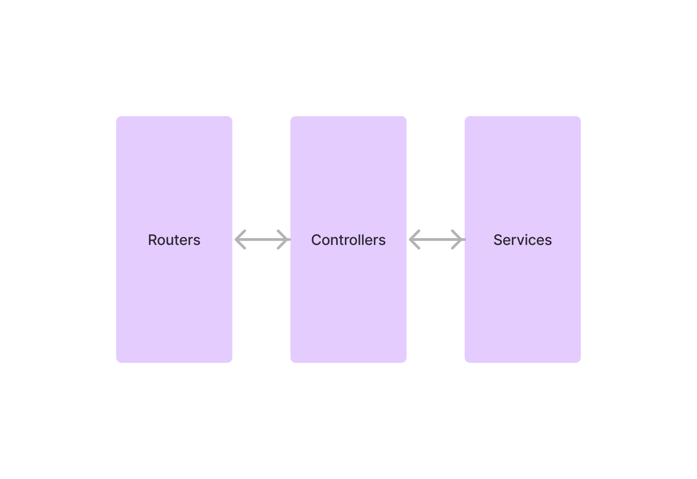

A web app using the Nest.js API framework which allows the user to search, display, and post realty listings.

## GitHub repository:
**[vue-nest-web-app__realtor-app](https://github.com/MarkWiltberger/vue-nest-web-app__realtor-app){:target="_blank"}**

## API in the cloud:

**GET [https://vue-nest-realtor-app-2.vercel.app/home](https://vue-nest-realtor-app-2.vercel.app/home){:target="_blank"}**

## The Nest.js API framework

